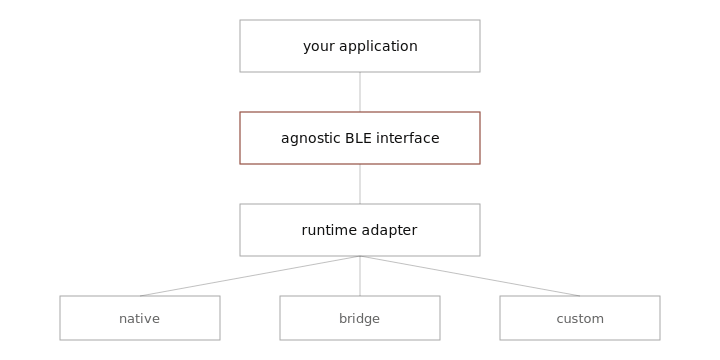

<ProjectHero package="@0xsarwagya/agnostic-web-ble" status="beta">
Bluetooth Low Energy for the web, whatever your browser might be.
</ProjectHero>

I refuse to write device logic for browsers.

A web application should describe how it wants to communicate with a BLE
device. It should not need to know which browser it is running in, whether
native Web Bluetooth exists, or how this runtime happens to represent
devices, characteristics, and disconnects. Your application should know the
device. The adapter should know the runtime.

<Install package="@0xsarwagya/agnostic-web-ble" />

## One interface

```ts
import { createBluetooth } from "@0xsarwagya/agnostic-web-ble";
import { nativeWebBluetoothAdapter } from "@0xsarwagya/agnostic-web-ble/adapters/native";

const bluetooth = createBluetooth({
  adapters: [nativeWebBluetoothAdapter()],
});

const device = await bluetooth.requestDevice({
  filters: [{ services: ["180f"] }],
});

const connection = await device.connect();
const service = await connection.getPrimaryService("180f");
const characteristic = await service.getCharacteristic("2a19");

const value = await characteristic.readValue();
```

## The model



Adapters own runtime weirdness. The application receives one API, one binary
type, one error taxonomy, and honest capability information — never browser
detection.

<Callout type="note">
No hardware on hand? The mock adapter runs the same application code
deterministically, which is also how the library tests itself in CI.
</Callout>

## Compatibility

Compatibility is reported from what is actually exercised, not from
marketing.

<CompatibilityMatrix
  rows={[
    {
      runtime: "Any JS runtime",
      adapter: "mock",
      request: "Tested in CI",
      connect: "Tested in CI",
      read: "Tested in CI",
      write: "Tested in CI",
      notify: "Tested in CI",
    },
    {
      runtime: "Chromium-based browsers",
      adapter: "native-web-bluetooth",
      request: "Implemented",
      connect: "Implemented",
      read: "Implemented",
      write: "Implemented",
      notify: "Implemented",
      note: "Manual hardware verification pending; treat as beta.",
    },
  ]}
/>

## Errors are part of the product

```ts
if (isBluetoothError(error) && error.code === "PERMISSION_DENIED") {
  // explain what the user can do — no string parsing
}
```

<ProjectLinks
  docs="/agnostic-web-ble/docs"
  demo="/agnostic-web-ble/demo"
  repository="https://github.com/0xsarwagya/agnostic-web-ble"
/>
